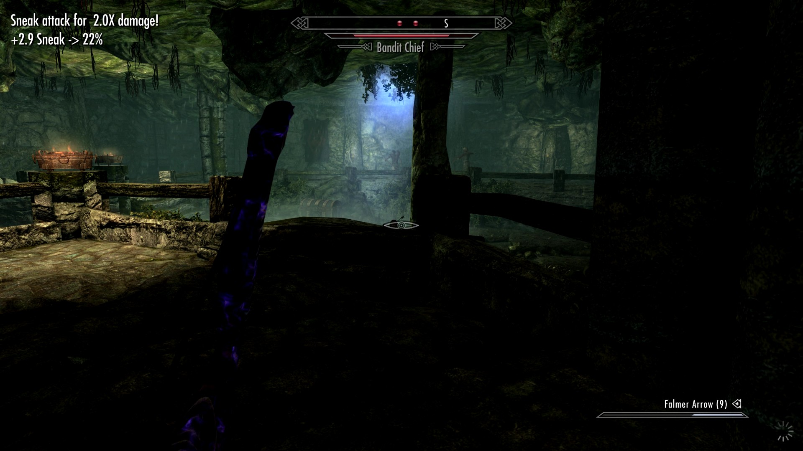

# SkillXPNotify



SKSE plugin for Skyrim Special Edition / Anniversary Edition that surfaces
**per-action skill XP gains** in the corner notification area, so progress
in the "hidden" skills (Sneak, Lockpicking, Pickpocket, Illusion-during-
combat, etc.) is visible without waiting for a full level-up.

Vanilla Skyrim only fires a corner notification when a skill *levels up*,
not on each XP increment. SkillXPNotify hooks the engine's
`PlayerCharacter::AddSkillExperience` to observe every grant and show:

```
+0.6 Sneak -> 28%
```

— delta gained in the throttle window, skill name, current progress
toward the next level.

## Compatibility

| | |
|---|---|
| Game | Skyrim SE / AE, build **1.6.1170** |
| SKSE | v2.2.6+ |
| Address Library | All-in-one v11 (Nexus 32444) — required |
| Other plugins | Stacks cleanly with Skill Uncapper et al. — observes after their rate multipliers have been applied |

VR is **not** supported in v1.

**Custom Skills Framework (CSF)** skill trees are also **not** supported.
SkillXPNotify hooks the engine's `RE::PlayerCharacter::AddSkillExperience`
function, which is specific to the 18 vanilla skills. CSF builds a
parallel skill system in Papyrus + its own SKSE plugin; its XP grants
don't flow through the same function and its skills aren't in
`RE::ActorValueList`. Adding CSF support would need either a Papyrus
shim mod (with an ESP, hard-depending on CSF) or a separate hook into
CSF's own runtime — possibly a v2.0 feature if there's demand.

## Install

1. Make sure SKSE 2.2.6+ and Address Library for SKSE Plugins are installed.
2. Drop `SkillXPNotify.dll` into `<Skyrim>/Data/SKSE/Plugins/`.
3. Optional: drop `SkillXPNotify.ini` next to it to override defaults
   (see [Configuration](#configuration)). With no `.ini`, sensible
   defaults apply.
4. Launch via the SKSE loader as usual.

To uninstall: delete the DLL (and the `.ini` if you placed one). No
ESP, no save-game state.

## Configuration

`SkillXPNotify.ini` (optional, sits next to the DLL). All values shown
below are the defaults that apply when the file is missing. Section
and key names are case-insensitive and ignore spaces / hyphens /
underscores. Comments via `;` or `#`.

```ini
[throttle]
; Per-skill leading-edge wait, in milliseconds. After you start using
; a skill we hold the first notification this long, accumulating XP,
; then emit one message with the SUM. Smaller = more responsive but
; more messages; larger = fewer messages with bigger numbers.
interval_ms = 1500

; Dead time after each emit before another notification can fire,
; even if Skyrim's queue reads empty. Covers the gap between
; dispatching a notification and it appearing in HUDNotifications.
post_emit_guard_ms = 500

[skip]
; Set a skill to true (or 1, yes, on) to suppress its corner
; notifications without disabling logging — useful if a particular
; skill spams during normal play and you'd rather just watch it via
; the log file.
;
; Aliases: archery=marksman, speech=speechcraft.
OneHanded   = false
TwoHanded   = false
Archery     = false
Block       = false
Smithing    = false
HeavyArmor  = false
LightArmor  = false
Pickpocket  = false
Lockpicking = false
Sneak       = false
Alchemy     = false
Speech      = false
Alteration  = false
Conjuration = false
Destruction = false
Illusion    = false
Restoration = false
Enchanting  = false
```

A working sample lives at `SkillXPNotify.ini.example` in this repo —
copy it next to the DLL and edit.

### Live config reload

Two ways to apply changes you make to `SkillXPNotify.ini` without
restarting the game:

- **Save-load triggers a reload.** Whenever you load a save or start a
  new game, SkillXPNotify re-reads its INI from disk. So edit the file
  in any text editor, then load any save — your changes take effect.
- **Hotkey** (default **F11**, configurable). Press it any time during
  gameplay and a corner notification confirms the reload. Set
  `[reload].key_code = 0` in the INI to disable, or change to any
  DirectInput scancode. (F12 is reserved for Steam screenshots — avoid.)

### What the throttle does

Skyrim's engine fires `AddSkillExperience` very frequently during
continuous activities (sneaking can produce 50+ grants per second).
Without a throttle every grant would queue a corner notification, and
since each notification displays for ~3 s, the queue would back up
for minutes.

The throttle:

1. **Per-skill leading-edge wait** — when you start using a skill, the
   first notification holds off for `interval_ms`, accumulating XP.
   At the end of the window we emit ONE message with the sum.
2. **Live queue check** — before emitting, we read
   `RE::HUDNotifications::queue.size()` and defer if Skyrim is still
   showing earlier messages. So you never see two notifications stacked
   on screen, regardless of how many skills are firing.

Trade-off: a single one-shot grant for a skill (e.g. one lockpick, no
other XP for that skill) doesn't fire until the next time that skill
earns XP. Acceptable for v1 since most XP-granting actions are bursty.

### Logging

Per-grant data is logged to:

```
%USERPROFILE%\Documents\My Games\Skyrim Special Edition\SKSE\SkillXPNotify.log
```

Format:

```
[YYYY-MM-DD HH:MM:SS.mmm] [info] skill-xp av=15 idx=9 delta=+0.0105 level=15.00 xp=0.2355 threshold=218.2535 pct=0.1%
```

`av` is the `RE::ActorValue` enum value, `idx` is the
`PlayerSkills::Data::skills` array index. Useful for tuning the
throttle or debugging unexpected skill grants.

## Changelog

See [CHANGELOG.md](CHANGELOG.md) for the per-version release notes.

## License

MIT — see [LICENSE](LICENSE).

Bundled `SimpleMath.h` / `SimpleMath.inl` are from Microsoft DirectXTK
under the MIT license; their original LICENSE is preserved at
[`cmake/stub-directxtk/include/SimpleMath.LICENSE`](cmake/stub-directxtk/include/SimpleMath.LICENSE).

## Building from source

Linux → Windows cross-compile (CMake + Ninja + vcpkg + clang-cl-20 +
lld-link-20 + an xwin-fetched MSVC SDK) is documented in
commit `530bbc73`) is locked in `.gitmodules`.

Author: **RexTheCapt** &lt;6693554+RexTheCapt@users.noreply.github.com&gt;
